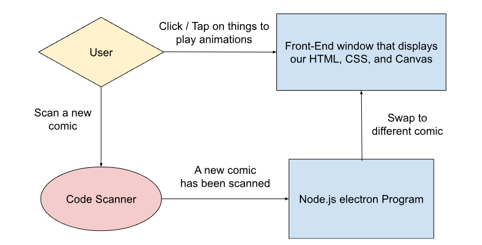

# Comics of the Cary

Authors: 
- Max Chu
- Elia Cohen
- Colby Heaton

## How To Use
1. Clone the repository.
2. ```cd``` into the cloned repository.
3. Run ```npm i``` to install all dependencies. This may take some time.
4. For TESTING, run the command ```npm start```. After a short amount of time, a window will appear with the app running.
5. For DISTRIBUTION, run ```npm run package```. This will create an ```out/``` directory in the root of the repository. Inside the directory, you will find a folder containing the entire program. Opening ```comics-of-the-cary.exe``` will run the app.

## File Structure (for the devs)
This project has ```two``` main directories.
### app
```app/main.js``` is the entry point for the electron compilation.
This directory should only include ```.js``` files. Think of this directory like a Node server - its purpose is to create the window that holds the HTML, CSS, and JS. 
If we want to use stuff from any NPM packages, that code should go here. That includes the QR Scanning / NFC / Image Recognition stuff, I think.
You can create functions in this directory and expose them to the client JS files, and we'll probably need to use that for QR Scanning / NFC / Image Recognition.
Additionally, files in this directory can emit messages to the ```client/``` directory. When a new comic is scanned, a message will be sent to the ```client/``` JS files, and they would have some listener function to change the display.

### client
This directory will house the HTML, CSS, and JS files for the "client" side. 
The ```media/``` directory can be used to store the comic cover images and gifs for animations.
The ```src/``` directory will be where the "client" JS files are stored.
I personally don't care how we do this, but I think ```one``` HTML file is enough. This HTML file would be a template for the cover displays, with the client JS swapping out images and animations based on messages emitted from the JS files in the ```app/``` directory.
